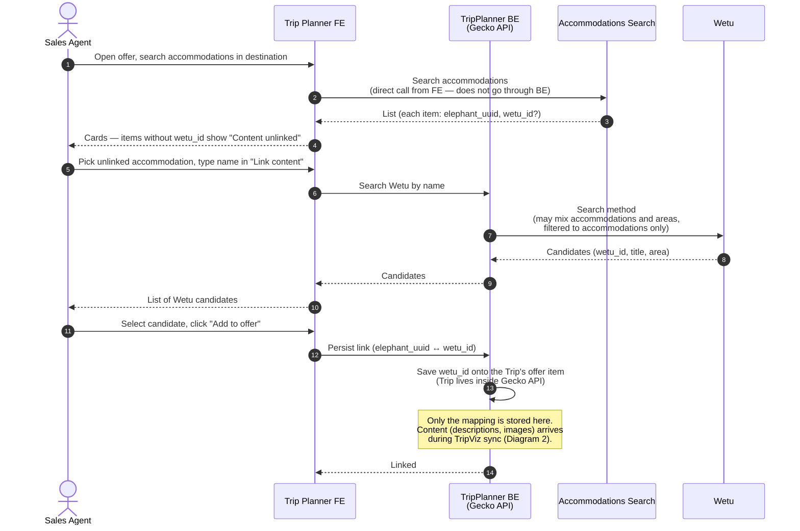
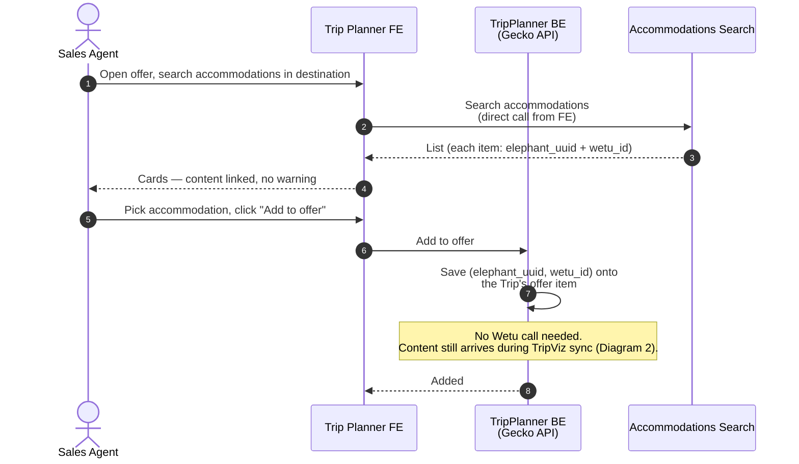
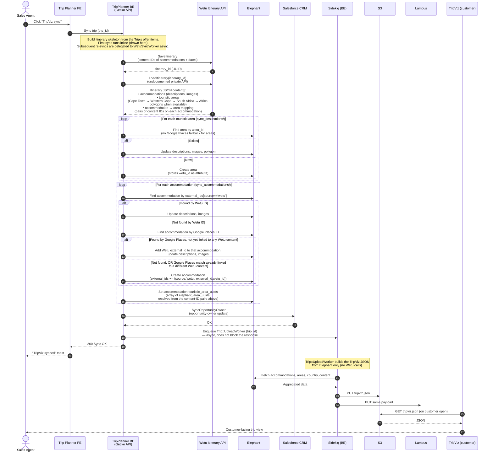
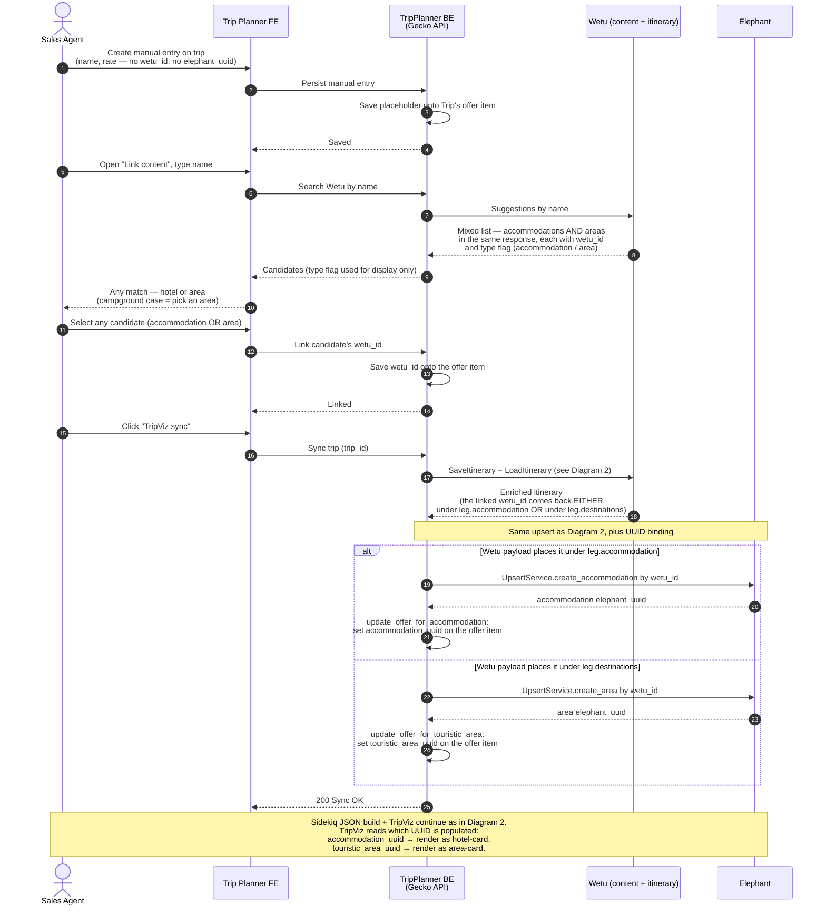
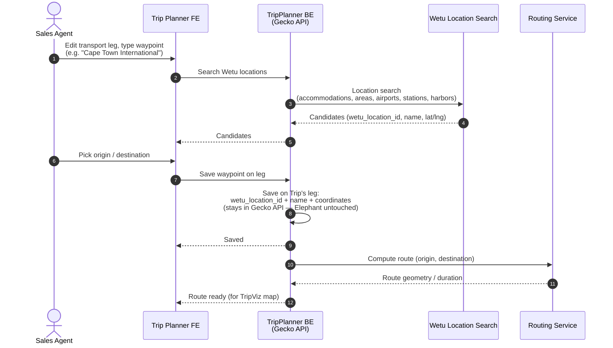

> Source-of-truth markdown lives in the repo at `OUTPUTS/2026-04-24_TripPlannerWetu-sequence-diagrams/TripPlannerWetu_Documentation.md`. Each diagram below has a placeholder where the rendered image goes (upload `diagram_*.png` from `/diagrams/`) and a collapsible block with the Mermaid source so it can be regenerated.

Actors / systems used throughout:

- **Sales Agent** — operator in TripPlanner.
- **Trip Planner FE** — the agent UI.
- **TripPlanner BE** (a.k.a. Gecko API) — backend that orchestrates everything below.
- **Accommodations Search** — external service called directly by the FE. Returns each accommodation with an optional `wetu_id`, read from Elephant's `external_ids[source=='wetu']`. Does not call Wetu directly.
- **Wetu** — external supplier. Two surfaces: the **Search** method (by name) and the **Itinerary** methods (`SaveItinerary` is publicly documented; `LoadItinerary` is undocumented / private). Wetu has two ID kinds: *content IDs* (integers — accommodations, areas, transport stops) and *itinerary IDs* (UUIDs). Both are written as `wetu_id` below; context disambiguates.
- **Elephant** — internal accommodation / touristic-area store. Source of truth for content shown to customers via TripViz.
- **Routing Service** — our routing / geometry service that computes routes and geometry for transport legs.
- **Sidekiq Worker** — TripPlanner BE's background-job processor (`Trip::UploadWorker` builds the TripViz JSON; `WetuSyncWorker` is used for async re-syncs).
- **Salesforce CRM** — receives an opportunity-owner update during TripViz sync (`SyncOpportunityOwner`).
- **S3** — storage for the generated TripViz JSON.
- **Lambus** — receives the same JSON payload as S3 from `Trip::UploadWorker`.
- **TripViz** — customer-facing trip visualization, reads its JSON from S3. Never talks to Wetu.

---

## Diagram 1 — Link content: mapping an existing accommodation to a Wetu record

Accommodations Search returns an item without a `wetu_id` ("Content unlinked"). The agent searches Wetu by name, picks a match, and the `wetu_id` is saved onto the Trip's offer item. No descriptions or images yet — those arrive during TripViz sync.

> 📎 **Image: Diagram 1** — upload `diagram_1.png` here.

Diagram 1 — Mermaid source

Side flow when Wetu has no match. The agent escalates to the Content Integration (CI) team, who emails Wetu (Excel list) and waits 1–4 days for Wetu to add the content. CI then uses TripPlanner with their own offer to link the new Wetu content (the same Diagram 1 flow) and runs a TripViz sync to import it into Elephant. After that the agent's offer can sync that content normally.

---

## Diagram 1b — Happy path: accommodation already has `wetu_id`

Short alternative to Diagram 1. If Accommodations Search already returns a `wetu_id`, the agent just picks the item — no Wetu round-trip, no "Link content" form.

> 📎 **Image: Diagram 1b** — upload `diagram_1b.png` here.

Diagram 1b — Mermaid source

TripViz sync runs only once every accommodation on the Trip has a `wetu_id` (via Diagram 1, 1b, or 3).

---

## Diagram 2 — TripViz sync: enriching the itinerary via Wetu's Itinerary API

The heavy interaction. BE sends the itinerary skeleton to Wetu (`SaveItinerary`), pulls enriched content back (`LoadItinerary`, undocumented), upserts into Elephant, then a background worker builds the TripViz JSON from Elephant alone (no Wetu calls in that step).

Note: before end-2024 the area hierarchy was derived from Wetu polygons; polygons became unreliable, so we now also persist the explicit accommodation → area mapping that Wetu exposes.

> 📎 **Image: Diagram 2** — upload `diagram_2.png` here.

Diagram 2 — Mermaid source

Async re-sync. If the offer was already fully synced before, `Wetu::UpdateService.sync` enqueues `WetuSyncWorker` and the FE gets `200 Sync OK` immediately; the worker performs the same sequence out-of-band.

### ID storage in Elephant after TripViz sync

Wetu IDs persisted into Elephant during sync:

| Elephant row | Where the Wetu ID is stored |
|---|---|
| accommodation | tagged entry in `external_ids[]`: `{ source: 'wetu', external_id: <wetu_id> }` |
| area | `wetu_id` column (direct attribute) |

Internal Elephant references set during sync (no Wetu IDs leak through):

| Elephant row | Field | Holds |
|---|---|---|
| accommodation | `touristic_area_uuids` | array of Elephant area UUIDs (resolved from Wetu pairs before persisting) |

---

## Diagram 3 — Manual input with Link Content (accommodation or area, same flow)

Used when Accommodations Search returns nothing. The agent creates a manual entry, then uses Link Content to pick from a mixed list (accommodations AND areas) returned by Wetu. Both kinds are linked the same way (single `wetu_id` slot). The accommodation-vs-area distinction only surfaces at render time, from which UUID field on the offer item is populated. Campground = pick an area instead of a hotel; same flow.

> 📎 **Image: Diagram 3** — upload `diagram_3.png` here.

Diagram 3 — Mermaid source

---

## Diagram 4 — Transport leg location search (self-contained)

Named waypoints (airport, station, harbor, …) are pulled from Wetu's location search and saved onto the Trip's leg. **Nothing is written to Elephant.** Routing Service computes the geometry for TripViz to draw the line.

> 📎 **Image: Diagram 4** — upload `diagram_4.png` here.

Diagram 4 — Mermaid source

Post-deprecation note. The simplest of the four to replace — swap Wetu location search for Google Places or Nominatim (OSM), licensing permitting, and replace the `wetu_location_id`-based identity checks in BE internals with a geo-distance heuristic.