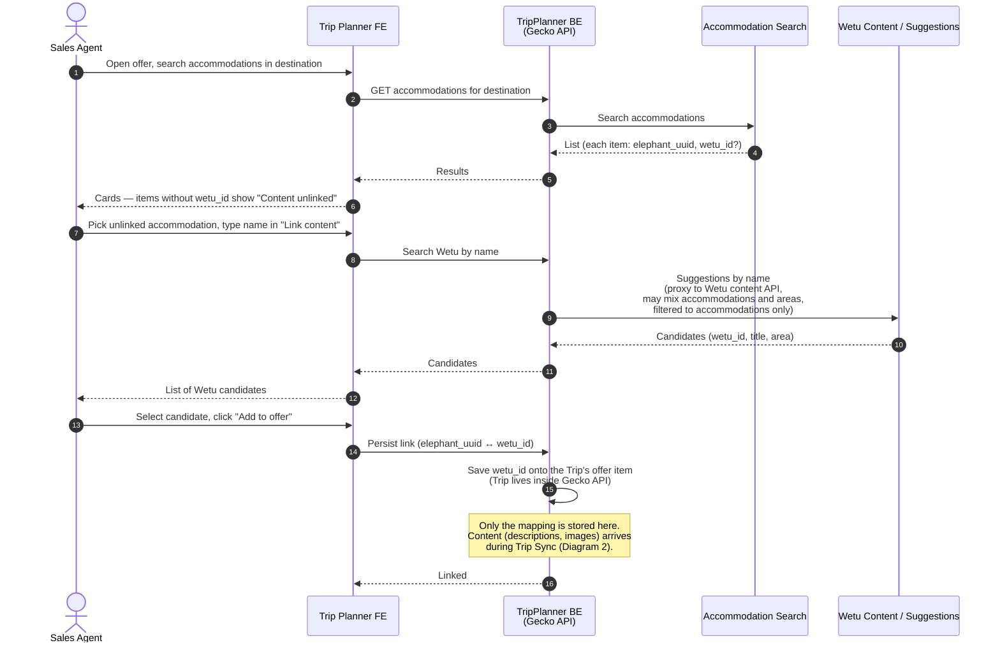
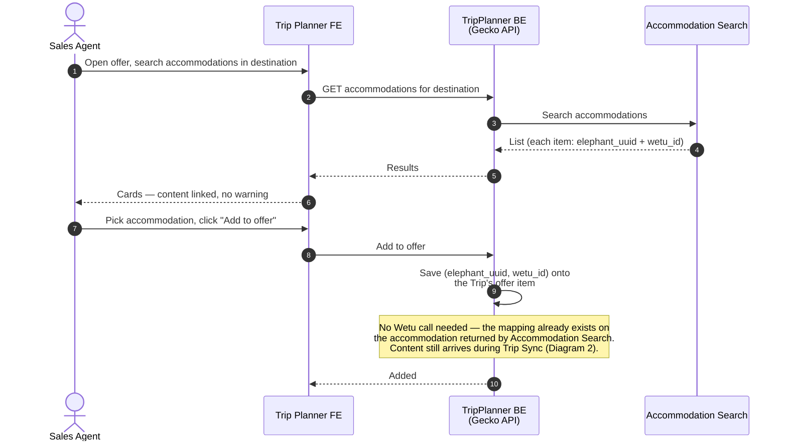
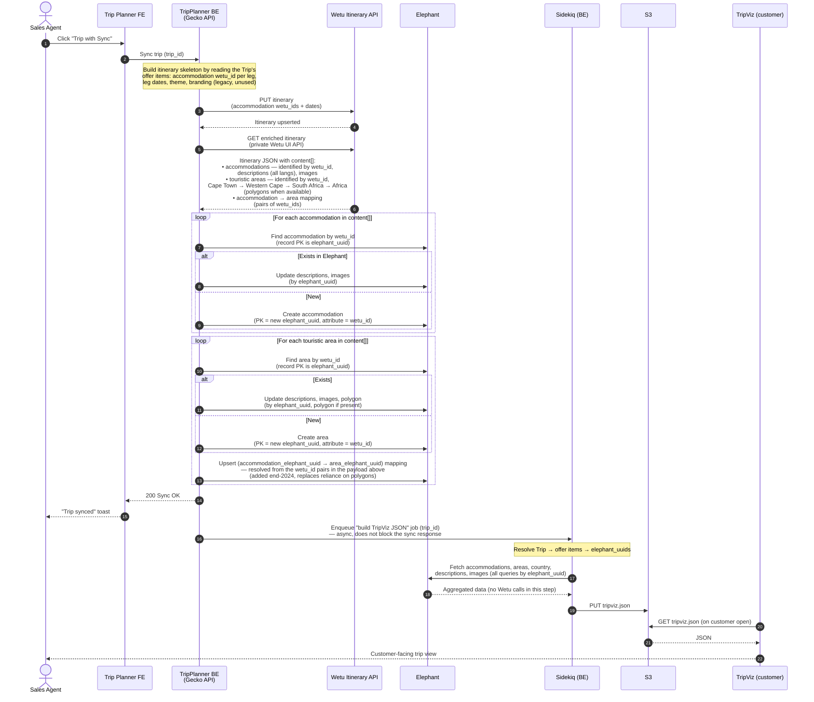
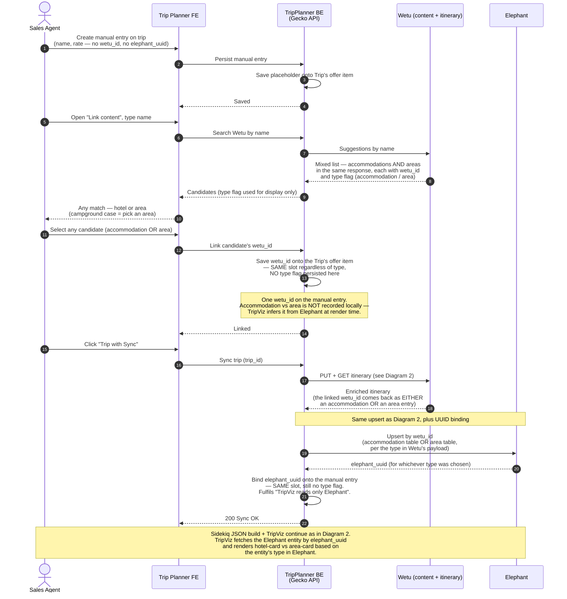
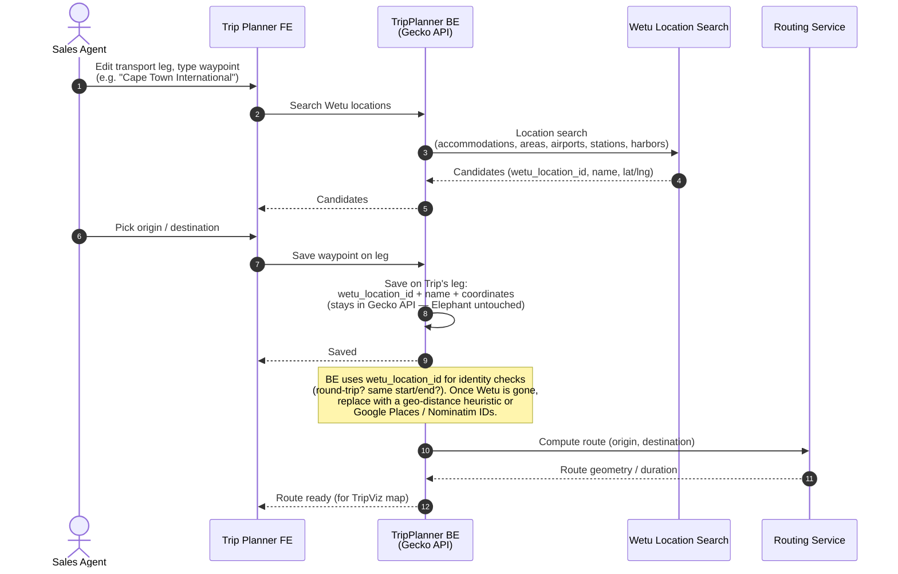

> Source-of-truth markdown lives in the repo at `OUTPUTS/2026-04-24_TripPlannerWetu-sequence-diagrams/TripPlannerWetu_Documentation.md`. Each diagram below shows a pre-rendered image (via Kroki) plus a collapsible block with the Mermaid source so it can be extended / regenerated later.

Actors / systems used throughout:

- **Sales Agent** — operator in TripPlanner.
- **Trip Planner FE** — the agent UI.
- **TripPlanner BE** (a.k.a. Gecko API) — backend that orchestrates everything below.
- **Accommodation Search** — our accommodation-search service (not a Wetu endpoint). Returns the candidate list with or without a `wetu_id`.
- **Wetu** — external supplier. Two surfaces are used: the **Content / Suggestions API** (search by name) and the **Itinerary API** (private, used to pull enriched content per itinerary).
- **Elephant** — internal accommodation / touristic-area store. Source of truth for content shown to customers via TripViz.
- **Routing Service** — our routing / geometry service that computes routes and geometry for transport legs.
- **Sidekiq Worker** — TripPlanner BE's background-job processor (builds the TripViz JSON).
- **S3** — storage for the generated TripViz JSON.
- **TripViz** — customer-facing trip visualization, reads its JSON from S3. Never talks to Wetu.

---

## Diagram 1 — Link content: mapping an existing accommodation to a Wetu record

Context. An accommodation returned by Accommodation Search without a `wetu_id` shows a "Content unlinked" warning. The agent uses the "Link content" form to search Wetu by name and pick a match. Only the **mapping** (`wetu_id` saved onto the offer item inside the Trip) is persisted at this step — no descriptions or images are fetched yet. The Trip object itself lives inside Gecko API, so this is a local write; Elephant is not touched here.

View Mermaid source (Diagram 1)

Post-deprecation note. When we stop taking content from Wetu, "Link content" against Wetu goes away for regular accommodations — Accommodation Search only returns items that already have content in our Catalog.

Offline side flow (not drawn). If Accommodation Search returns nothing for the name the agent needs, the agent reaches out to the Content Integration team. That team batches requests, emails Wetu (Excel list mentioned on the Miro sketch), waits 1–4 days for Wetu to populate content, then runs the Trip Sync themselves. Entirely out-of-band — no TripPlanner UI involved — so it's not drawn as a sequence diagram, but it's the implicit "otherwise" branch of this flow.

---

## Diagram 1b — Happy path: picking an accommodation that already has `wetu_id`

Context. This is the short alternative to Diagram 1. If Accommodation Search returns the accommodation with a `wetu_id` already attached (it was linked on a previous trip and the content is already in Elephant), the agent just picks it — no "Link content" form, no Wetu round-trip. The `wetu_id` is saved onto the Trip's offer item and the offer is ready for Trip Sync (Diagram 2).

View Mermaid source (Diagram 1b)

Precondition for Trip Sync. Trip Sync can only run once **every** accommodation on the Trip has a `wetu_id` attached to its offer item — i.e. every accommodation has gone through either Diagram 1a or Diagram 1b (or Diagram 3 for manual input).

---

## Diagram 2 — Trip Sync: enriching the itinerary via Wetu's Itinerary API

Context. The heavy interaction. On "Trip with Sync", TripPlanner BE sends the itinerary skeleton (`wetu_id`s + leg dates) to Wetu's **itinerary** API, pulls the enriched itinerary back, and upserts accommodations and touristic areas into Elephant. A Sidekiq job then builds the TripViz JSON purely from Elephant (Wetu is not touched in that step).

Two important callouts from Gregor:
- The endpoint id pulling the enriched itinerary is Wetu's **private** API (the one that drives their own UI). 
- Before end-2024, area hierarchy was derived purely from polygons imported from Wetu. Polygons became unreliable / missing, so we additionally persist the explicit accommodation → area mapping that Wetu exposes in the enriched itinerary.

![Diagram 2 (rendered via Kroki)](https://kroki.io/mermaid/png/eNqtVt1u2zYUvs9THPhmMiZ3QbIroQ0Qp06RGUiNydkuhiGgpGObDUWyJGXXverVHmDYE_TR8iQ7JOUf2S5QtA3g6Ifn9_vOjyy-b1CW-JqzuWH1GdAfa5ySTV2giY-lUwau5ygdMAs5E2jjYzjWzDhecs3oeDrxElPDNUwEkxIN3I6OpIajjdRGaDh6WZhfrpI3WD4puJ7c9Y-U_kTXeLVwvXOc1JhZe9kj0ZFAvfCy4YadiDMfh0x4hU_8PSTD0bG__DKIXB7nSHH_wT9uUvC3SdlYp2o0_bMgHsAZXF1NJxncCF4-QS9gsuJuAflalr0gNp2QzHCUhVfgvETi_z_yKsZzrxyCWgaAMhg2XFTAt6nbJxRITEGxBoOs4nIOboEhqp9sAFTNZqTMHdY2Ix5LVdeqYo6T0opwJEegSUDgPA3ydAN0jjb1lmpMoTBMBssJnbFynUIjG4tVm-lwRCl4SjKYPEx3wUU6T3q08HP0EXP0yoMWhx2tjbZoHFaHTt6MpoDS8HKB1aE3bfiS7MYKebjbldFpF7_lb-8jI6WSjgj76-8sGHr-9LmLlYXnT_8BFYt0fMbJMQHeJhNhA6jQlgR7lE6YEECVPbf9FHjN5mi3hp1qDLdUTMCIs6-wfMM0UapWEp7_-ZdSsQ6NjG_9i1w1lMH1jCBh4UW8bZUTrcR67mNaLVACWzIuWCGwfzrRYMDHBTXTmljfmmHcWFCzLYct_UIpDbc0HZCViwNbXO6ADcJbKkNbZnDLZXWgs0s_UmqwVKaCyRi4BWy7-bFpNg0SxpOgjv9AmFrvstPyp7w-aF98HcI6JCUUwxc8obAI97j6ou0bgo5sd3KKRimDVyBx1TWdAnPU8EVDSq82me_5k7H-_fUE3N1S-lq8vej3wfwt0KbQVuJpjLfHwGegDVrK4htwp8sPgPs4LT-LoDvNHjuWt43Tfd3v9JFvdUpNiSU1-syoOkzr7RwOLUYk-pearYVixFZB07-dpVVFahTj4OL84teULGnBStrEBgVntMGB0Nu0e79bN5RNu40uzs_jtnk73qwgOgn7KmuXlKVjrHpUXsy6vSmfjzMYSfpaaBB6RdhFm_3nR2kP3qlit7-2GTNvL4VKUahSOSiEon3ok_QHHhBNAePZwcLz3n6PYMXvCY_w3joLzx2wY13m472CR3c4lagQw9xNqVca6cw6jtlTJRvHOOVrOD2cngrB0aAF53o-N7QjaWv5_cYgkSruopIMtdRSf9EA1_1drPllXJ0euCX_-OKdVTKC0aLbyvjNty8DCf023x2gNMrW6GXgOupmgZqOtR3dN63yYMbK8O3gYV5yXP0PMVtRZg)

View Mermaid source (Diagram 2)

### ID assumptions used above (please verify — flag any wetu_id leaks)

The point of this list is to make every ID explicit so we can spot any wetu-specific ID sneaking into storage or logic where it doesn't belong. Confidence reflects how sure I am; "verify" items are where I'd like Gregor to confirm or correct.

| Step | Assumed ID in use | Confidence |
|------|-------------------|------------|
| Sync trigger — TP FE → BE | `trip_id` | High |
| Build itinerary skeleton | `wetu_id` per accommodation, read off the Trip's offer items (stored in Gecko API) | High |
| PUT / GET itinerary at Wetu | `wetu_id` on the wire (forced by Wetu's API) | High |
| Itinerary JSON content[] — accommodations, areas, and the accommodation→area pairs all identified by `wetu_id` inside Wetu's namespace | High |
| Elephant lookup for an accommodation / area | query by the `wetu_id` attribute; record PK is `elephant_uuid` | **Verify** — need to confirm Elephant actually has a `wetu_id` index rather than re-scanning |
| Elephant create for an accommodation / area | `elephant_uuid` as PK, `wetu_id` stored as attribute | High |
| Explicit accommodation → area mapping stored in Elephant | `elephant_accommodation_uuid → elephant_area_uuid` (translated from the `wetu_id` pair before persisting) | **Verify** — if we actually persist `wetu_id` pairs here, that's a wetu_id leak into Elephant worth retiring during deprecation |
| Sidekiq job argument | `trip_id` (job resolves to `elephant_uuid`s itself by reading the Trip) | **Verify** — job could equally take the offer_id or a list of elephant_uuids |
| Sidekiq fetches from Elephant | all queries by `elephant_uuid` | High |
| S3 object | keyed by `trip_id` (or a derived URL) | **Verify** |

Post-deprecation note. This is the interaction we want to remove. Content should come from catalog (Expedia / own-managed) instead of Wetu. Gregor: *"this would all just go away, without replacement"* — the upsert-into-Elephant half and the Sidekiq / S3 / TripViz half stay; only the Wetu calls and the Wetu-sourced content drop out.

Addresses the open question pinned on the Miro sketch ("why is area syncing done separately from the itinerary API call?") — it isn't a separate call. Areas arrive inside the same enriched itinerary payload as accommodations; we just branch on type and upsert into different Elephant tables. Worth re-checking in code that there's truly no second round-trip.

---

## Diagram 3 — Manual input with Link Content (accommodation or area, same flow)

Context. Used where there is no DMC API connection (Accommodation Search returns nothing). The agent creates a manual entry on the Trip **without** an Elephant UUID. Link Content returns a **mixed list** from Wetu — both accommodations and areas in the same response — and the agent can pick any one of them. **Both kinds of item are linked the same way**: the picked `wetu_id` is saved onto a single slot on the manual entry, with no type flag stored alongside it. The accommodation-vs-area distinction only surfaces later, at render time, when TripViz fetches the resolved Elephant entity and sees whether it's an accommodation record or an area record. The campground case is just a concrete instance of picking an area (e.g. "Cape Town") instead of a hotel — same operation, same storage, different rendering downstream.

Because there is no Elephant UUID yet, the first Trip Sync both enriches content **and** establishes the `elephant_uuid` on the manual entry so the invariant "TripViz only reads Elephant" holds.

![Diagram 3 (rendered via Kroki)](https://kroki.io/mermaid/png/eNptVMty2zoM3fcrMN7UmTppp8tMmxk7Udv0YXtq595lhqZgixOKVEkqqbrqR_QL75dcgJQUy6oXtkUBIM7BOfD4o0Yj8UaJgxPlC6CPqIM1dblDlx5lsA7mBzQBhIeN0OjTY3xdCReUVJWg19s1R2ydqmCthTHo4EM2ilpkXVQXtMje7dzrq-lHlA8W5uvbs1HSvxhqTou_U2lN4H5egQqKKgjXjFMyjVXBOfEPnbyIIbH186ur7foSrh2KgFAKUwsNdO4asAYC9ZY6MqLEGTgO-u_3HzAWnqiBe5XP-D-2he_rWuWpge2aSi-yS1ij88qHQe0YscjaiI14RKi0kFhYnRMNBMpGXl56sPs9naiAZZfUtsxZ-RjJqkIDk6_KPEBLzmQGoakQGMKwtQ0KJ4tE5a55Doid8SmF1IcD-qCs8YMQfnvelvmmfmIOmkEyN0JKW5Y2FylrvrwBQfT6SKQiUgsET3XAoa8ognhFQW08qVB0rMZYYfLU-V6LA0wHdeF1LHp2Qso15SiKIGVOn1NrT_3tSby58sQzj1Y3_ZgoNRJ4CXPT0JgC9cI4ChtQA2XxRUkFUpTVwdmaGpPCI7yHSskHEKZtZjSNDSlDkl2osOxaO0Wy-n4EpZ9NmmCXQ0JomfmLdNo3STbM7kg6sXvGtJl_y8BrG4j8g3A5WZjjIs2zGLVcHXFeJe0SewW6NPglsQL2MZqV1GaOr4-XH-v8IpacD-A--ggXlIflakt9SOty1o-VQuuGqY9ZDOIf9QuUIRSeYMDe2bL3MAjGYNguQZV4cSIEpu9v9rjWPLBJXE1RcJvGyMmJLegoWp80RN_3naWPbLG-29LO-Zhtn_cOTD0itPsT3p6NbJIZp2RBSPuUJComTcd2eyqJL1LwTrC2aG3dbj9l31tLwFg8SX2J8VaDx1OaRcpYK-S5uvLo4v7uO53R7qk93N3d3sBOkeDM4Rlum3uX0mgDHBv0RMhB7DR2ck5PSVMVD4lQRmHRBmBWSJ-VaLQVLbnxoo6qwT6FKVv3qWDyGFGs8kQIZGE9mrOhIxaE4CS_98WxNMeWmAHtOa15n_cOSAL-UOu90j7JhjVJ-HIft0ivx8mpAt--eZOUtPpyOpMoyH4sKscH9QM-b1ZL2NVK56Ss7iJe4crUyAMj4vqZXQwsskfaWSQYxtj7g65QoeGRDdjoN2syj09r7lzSMuismR52gremNTGBK6eCNLdujN1VF_8DeZy2_g)

View Mermaid source (Diagram 3)

Post-deprecation note. Replace the Wetu search with a search against our own catalog that returns the same mixed list (accommodations + areas). The storage contract on the Trip's offer item doesn't change — still one `wetu_id`-equivalent slot, still no type flag. The UUID-binding-on-first-sync step goes away because picking a catalog item already returns an `elephant_uuid` directly.

---

## Diagram 4 — Transport leg location search (self-contained)

Context. For transport legs we need named waypoints with coordinates (airport, train station, harbor, ferry port, sometimes even an accommodation acting as a pickup point). These are pulled from Wetu's location search and saved onto the Trip's leg inside Gecko API — **nothing is written to Elephant**. The Routing Service then computes the geometry between the two waypoints so TripViz can draw the line with a proper route.

View Mermaid source (Diagram 4)

Post-deprecation note. The simplest of the four to replace — swap Wetu location search for Google Places or Nominatim (OSM), licensing permitting, and replace the wetu_location_id-based identity checks in BE internals with a geo-distance heuristic. Gregor called this *"a story on a sprint, not an initiative"*.

---

## Open questions to refine together

1. **Accommodation Search branch** (Diagram 1). On the Miro sketch, the arrow from Accommodation Search labels the return as "accommodations with optional wetu_id". Is that service reading `wetu_id` straight from Elephant, or does it merge from elsewhere? Worth pinning before we remove Wetu — it drives whether "Link content" can disappear entirely or needs a catalog-backed replacement.
2. **Itinerary API payload shape** (Diagram 2). Areas and accommodations currently arrive in the same `content[]` array. The Miro question *"why area syncing done separately from itinerary API?"* — I think it's a naming artefact, not a separate network call. Worth confirming in the Gecko code before we promise "one diagram covers both".
3. **Explicit accommodation → area mapping** (Diagram 2). Stored on the accommodation, on the area, or a join? Affects what needs to be sourced from elsewhere once Wetu's polygons / hierarchy go away.
4. **Manual entry storage (Diagram 3).** The diagram assumes Link Content stores a single `wetu_id` slot with no type flag on the manual entry, and that TripViz infers "accommodation vs area" from the Elephant entity at render time. Worth confirming that (a) the slot is actually type-agnostic and (b) TripViz really does read the type from Elephant and not from a flag on the Trip's offer item.
5. **Transport leg internal checks** (Diagram 4). Besides round-trip / same-start-end, any other Gecko logic keyed on `wetu_location_id` (transport type inference, leg merging, etc.) that should be surfaced before we kill Wetu?
6. **Content Integration team offline flow**. Not drawn. Worth a 5th diagram (even a boxes-and-arrows one) if we want it in the same doc — currently only mentioned in prose under Diagram 1.
7. **Dead theme/branding buttons**. Gregor flagged that "theme" and "branding" selectors on the trip page drove only the legacy Wetu-side visualization, which no customer hits. Remove from UI rather than model — not drawn.