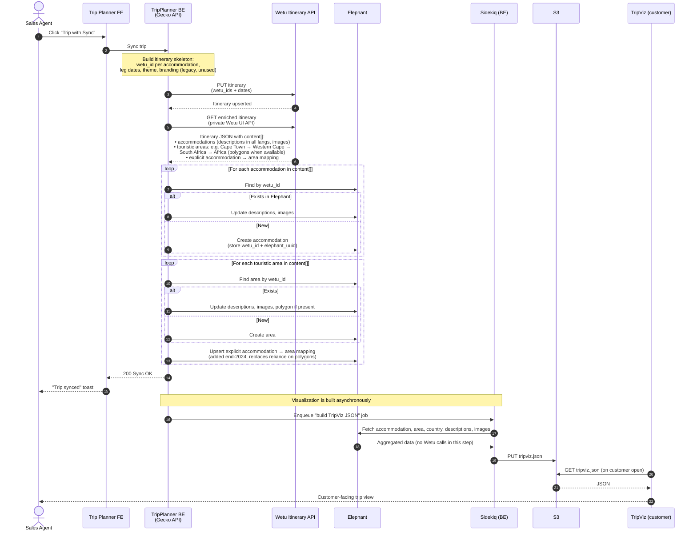
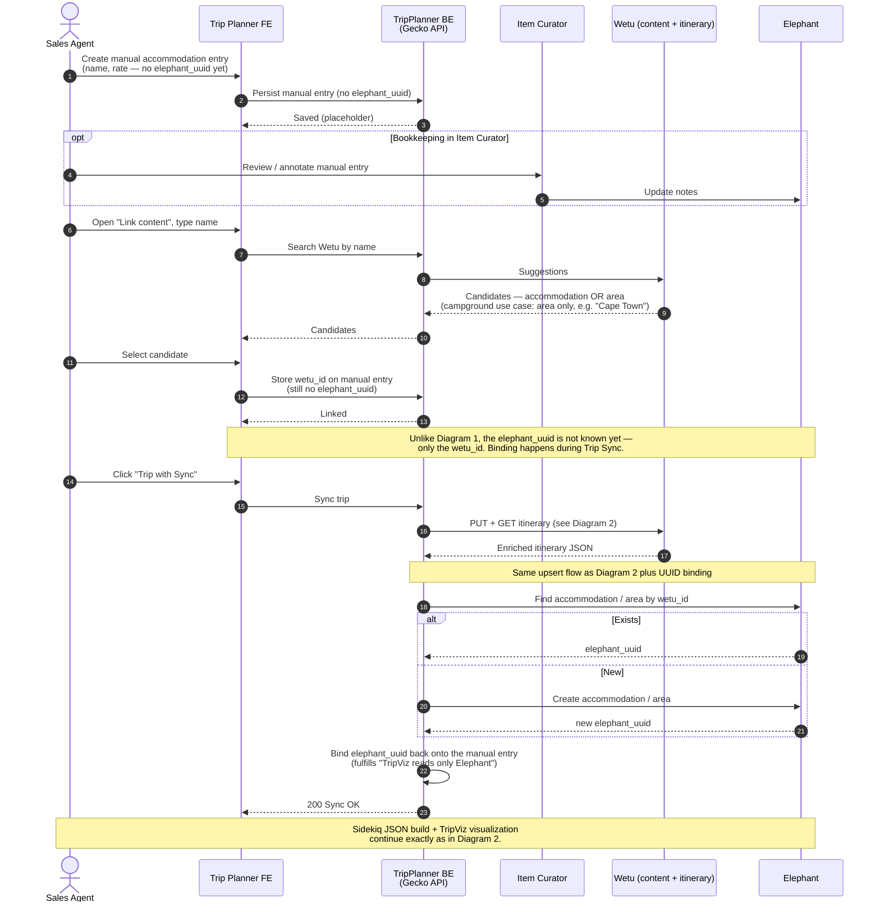
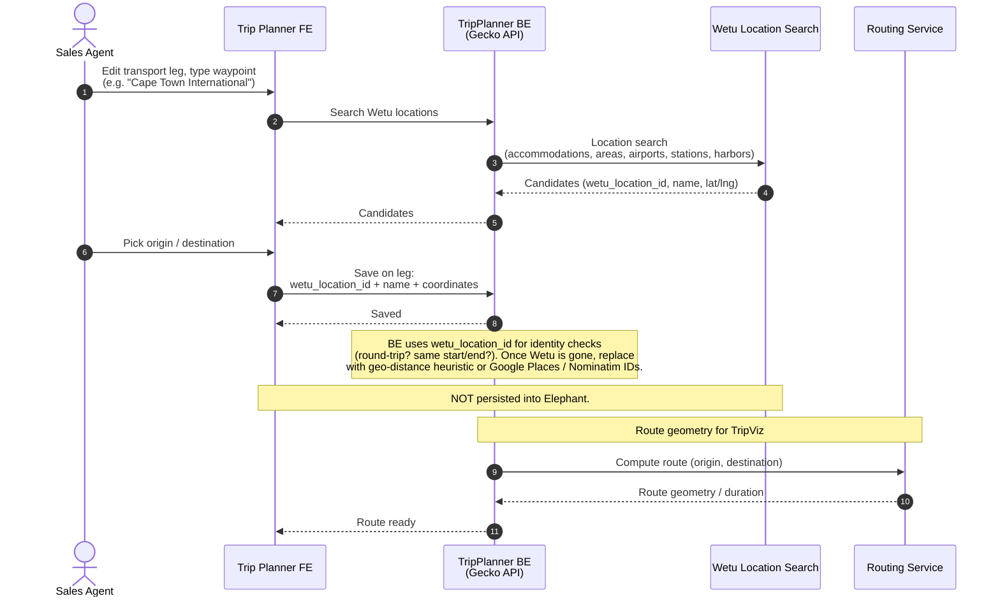

# TripPlanner ↔ Wetu — current-state sequence diagrams

Reconstructed from the 2026-04-22 catch-up with Gregor, cross-referenced against the 3-section sketch on our Miro board (https://miro.com/app/board/uXjVHe9yEWY=/) and the 2026-04-23 drawing session.

Four diagrams are captured below — the Miro sketch groups flows into 3 sections (Link Content and Trip Sync are combined into the top "Default accommodation" section), but here they are split to keep each diagram readable. Mapping:

- Diagrams 1 + 2 ↔ Miro top section ("Default accommodation content linking" + sync)
- Diagram 3 ↔ Miro middle section ("Manual accommodation input")
- Diagram 4 ↔ Miro bottom section ("Transport leg management")

Actors / systems used throughout (names aligned with the Miro sketch):

- **Sales Agent** — operator in TripPlanner.
- **Trip Planner FE** — the agent UI.
- **TripPlanner BE** (a.k.a. Gecko API) — backend that orchestrates everything below.
- **Accommodation Search** — our accommodation-search service (not a Wetu endpoint). Returns the candidate list with or without a `wetu_id`.
- **Item Curator** — our admin UI for creating/editing accommodations and areas manually.
- **Wetu** — external supplier. Two surfaces are used: the **Content / Suggestions API** (search by name) and the **Itinerary API** (private, used to pull enriched content per itinerary).
- **Elephant** — internal accommodation / touristic-area store. Source of truth for content shown to customers via TripViz.
- **Routing Service** — our routing / geometry service that computes routes and geometry for transport legs.
- **Sidekiq Worker** — TripPlanner BE's background-job processor (builds the TripViz JSON).
- **S3** — storage for the generated TripViz JSON.
- **TripViz** — customer-facing trip visualization, reads its JSON from S3. Never talks to Wetu.

---

## Diagram 1 — Link content: mapping an existing accommodation to a Wetu record

Context. An accommodation returned by Accommodation Search without a `wetu_id` shows a "Content unlinked" warning. The agent uses the "Link content" form to search Wetu by name and pick a match. Only the **mapping** (`wetu_id` stored against the Elephant accommodation) is persisted at this step — no descriptions or images are fetched yet.

```mermaid
sequenceDiagram
    autonumber
    actor Agent as Sales Agent
    participant TP as Trip Planner FE
    participant BE as TripPlanner BE<br/>(Gecko API)
    participant AS as Accommodation Search
    participant Wetu as Wetu Content / Suggestions
    participant Eleph as Elephant

    Agent->>TP: Open offer, search accommodations in destination
    TP->>BE: GET accommodations for destination
    BE->>AS: Search accommodations
    AS-->>BE: List (each item: elephant_uuid, wetu_id?)
    BE-->>TP: Results
    TP-->>Agent: Cards — items without wetu_id show "Content unlinked"

    Agent->>TP: Pick unlinked accommodation, type name in "Link content"
    TP->>BE: Search Wetu by name
    BE->>Wetu: Suggestions by name<br/>(proxy to Wetu content API — may mix accommodations AND areas;<br/>filtered here to accommodations only)
    Wetu-->>BE: Candidates (wetu_id, title, area)
    BE-->>TP: Candidates
    TP-->>Agent: List of Wetu candidates

    Agent->>TP: Select candidate, click "Add to offer"
    TP->>BE: Persist link (elephant_uuid ↔ wetu_id)
    BE->>Eleph: Store wetu_id on accommodation
    Eleph-->>BE: OK
    BE-->>TP: Linked

    Note over TP,Eleph: Only the mapping is stored here.<br/>Content (descriptions, images) arrives during Trip Sync (Diagram 2).
```

Post-deprecation note. When we stop taking content from Wetu, "Link content" against Wetu goes away for regular accommodations — Accommodation Search only returns items that already have content in our catalog.

Offline side flow (not drawn). If Accommodation Search returns nothing for the name the agent needs, the agent reaches out to the Content Integration team. That team batches requests, emails Wetu (Excel list mentioned on the Miro sketch), waits 1–4 days for Wetu to populate content, then runs the Trip Sync themselves. Entirely out-of-band — no TripPlanner UI involved — so it's not drawn as a sequence diagram, but it's the implicit "otherwise" branch of this flow.

---

## Diagram 2 — Trip Sync: enriching the itinerary via Wetu's Itinerary API

Context. The heavy interaction. On "Trip with Sync", TripPlanner BE sends the itinerary skeleton (`wetu_id`s + leg dates) to Wetu's **itinerary** API, pulls the enriched itinerary back, and upserts accommodations and touristic areas into Elephant. A Sidekiq job then builds the TripViz JSON purely from Elephant (Wetu is not touched in that step).

Two important callouts from Gregor:
- The endpoint used to pull the enriched itinerary is Wetu's **private** API (the one that drives their own UI). Called out as "engineering, not hacking" — but we aren't formally licensed to use it.
- Before end-2024, area hierarchy was derived purely from polygons imported from Wetu. Polygons became unreliable / missing, so we additionally persist the explicit accommodation → area mapping that Wetu exposes in the enriched itinerary.



Post-deprecation note. This is the interaction we want to remove. Content should come from catalog (Expedia / own-managed) instead of Wetu. Gregor: *"this would all just go away, without replacement"* — the upsert-into-Elephant half and the Sidekiq / S3 / TripViz half stay; only the Wetu calls and the Wetu-sourced content drop out.

Addresses the open question pinned on the Miro sketch ("why is area syncing done separately from the itinerary API call?") — it isn't a separate call. Areas arrive inside the same enriched itinerary payload as accommodations; we just branch on type and upsert into different Elephant tables. Worth re-checking in code that there's truly no second round-trip.

---

## Diagram 3 — Manual accommodation input (including campground / area-as-accommodation)

Context. Used where there is no DMC API connection. The agent creates an accommodation **without** an Elephant UUID, optionally using Item Curator for bookkeeping. "Link content" can target either an accommodation **or** an area (campground case — the customer stays "somewhere in Cape Town"). Because there is no Elephant UUID yet, the first Trip Sync both enriches content **and** establishes the Elephant UUID so the invariant "TripViz only reads Elephant" holds.



Post-deprecation note. Replace the Wetu search in "Link content" with a search against our own catalog (accommodations with content) and our own touristic areas (for the campground case). The UUID-binding-on-first-sync step goes away, because picking a catalog item already returns an elephant_uuid.

---

## Diagram 4 — Transport leg location search (self-contained)

Context. For transport legs we need named waypoints with coordinates (airport, train station, harbor, ferry port, sometimes even an accommodation acting as a pickup point). These are pulled from Wetu's location search. **Not** persisted in Elephant. The Routing Service then computes the geometry between the two waypoints so TripViz can draw the line with a proper route.



Post-deprecation note. The simplest of the four to replace — swap Wetu location search for Google Places or Nominatim (OSM), licensing permitting, and replace the wetu_location_id-based identity checks in BE internals with a geo-distance heuristic. Gregor called this *"a story on a sprint, not an initiative"*.

---

## Open questions to refine together

1. **Accommodation Search branch** (Diagram 1). On the Miro sketch, the arrow from Accommodation Search labels the return as "accommodations with optional wetu_id". Is that service reading `wetu_id` straight from Elephant, or does it merge from elsewhere? Worth pinning before we remove Wetu — it drives whether "Link content" can disappear entirely or needs a catalog-backed replacement.
2. **Itinerary API payload shape** (Diagram 2). Areas and accommodations currently arrive in the same `content[]` array. The Miro question *"why area syncing done separately from itinerary API?"* — I think it's a naming artefact, not a separate network call. Worth confirming in the Gecko code before we promise "one diagram covers both".
3. **Explicit accommodation → area mapping** (Diagram 2). Stored on the accommodation, on the area, or a join? Affects what needs to be sourced from elsewhere once Wetu's polygons / hierarchy go away.
4. **Campground payload** (Diagram 3). When the manual entry is linked to an **area** (not an accommodation), does the itinerary skeleton send the area's `wetu_id` in the accommodation slot, or in a separate slot? Gregor said *"we send an itinerary where the area is the accommodation"* — need the exact shape before we can mimic it post-deprecation.
5. **Item Curator's role** (Diagram 3). On the sketch it appears alongside the manual-input flow, but in Gregor's walk-through it was mostly a viewer ("I can only trust my dear elephant viewer"). Is it actually part of the write path today, or only a read/annotate surface? Drawn as optional for now.
6. **Transport leg internal checks** (Diagram 4). Besides round-trip / same-start-end, any other Gecko logic keyed on `wetu_location_id` (transport type inference, leg merging, etc.) that should be surfaced before we kill Wetu?
7. **Content Integration team offline flow**. Not drawn. Worth a 5th diagram (even a boxes-and-arrows one) if we want it in the same doc — currently only mentioned in prose under Diagram 1.
8. **Dead theme/branding buttons**. Gregor flagged that "theme" and "branding" selectors on the trip page drove only the legacy Wetu-side visualization, which no customer hits. Remove from UI rather than model — not drawn.
