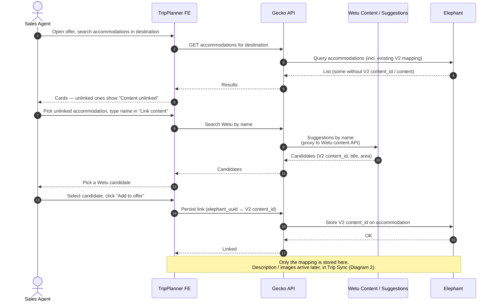
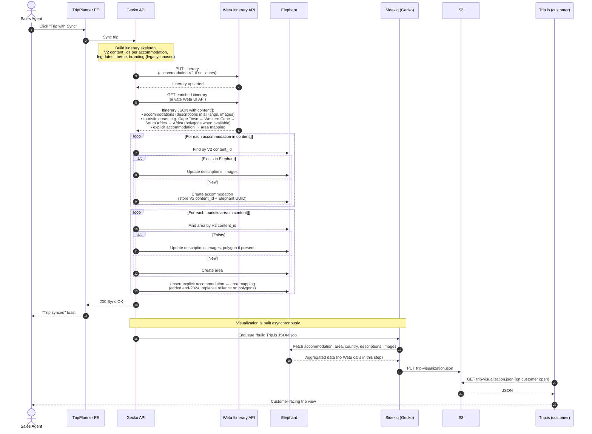
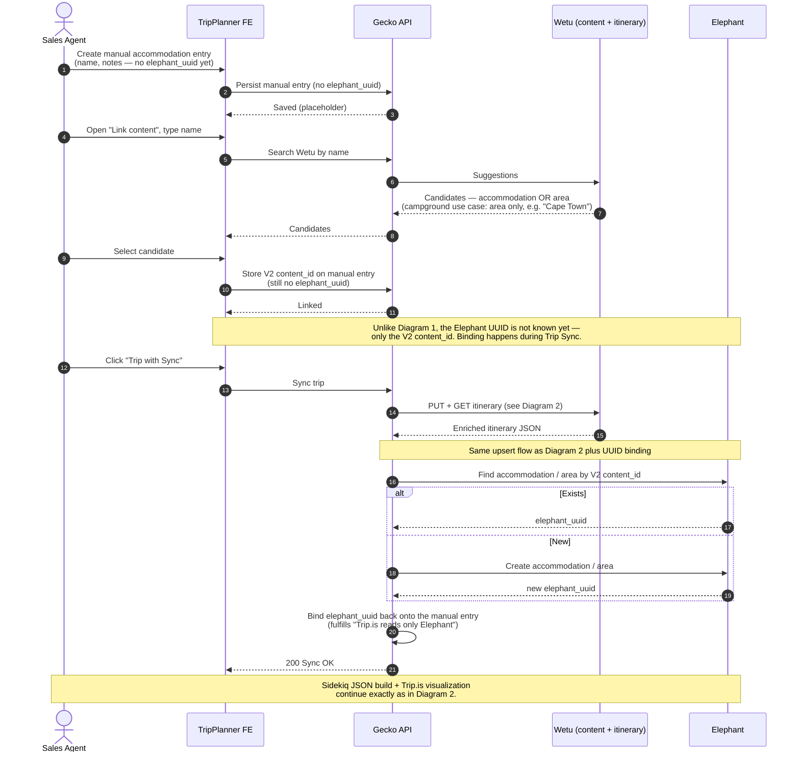
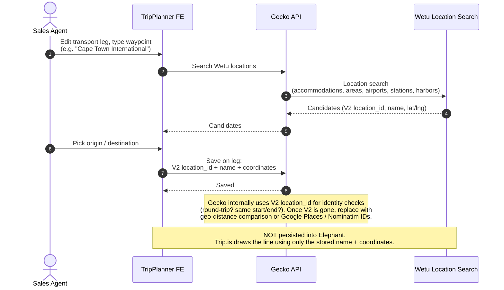

# TripPlanner ↔ Wetu — current-state sequence diagrams

Reconstructed from the 2026-04-22 catch-up with Gregor and the 2026-04-23 follow-up drawing session. Four distinct interaction patterns are captured, because Gregor's key message was *"there's not one sequence, but different interactions for different purposes"*.

Actors / systems used throughout:

- **Sales Agent** — operator in TripPlanner.
- **TripPlanner Frontend** (TP FE) — the agent UI.
- **Gecko API** — TripPlanner backend. Holds trip / offer / itinerary state and orchestrates everything below.
- **Wetu** — external supplier of accommodation / area / location content. Two surfaces are used: the **Content / Suggestions API** (for search) and the **Itinerary API** (used, privately, to pull enriched content per itinerary).
- **Elephant** — our accommodation / touristic-area store. Source of truth for content shown to customers via Trip.is.
- **Sidekiq Worker** — Gecko's background-job processor.
- **S3** — storage for the generated Trip.is visualization document.
- **Trip.is** — customer-facing trip visualization site, reads a JSON from S3. Never talks to Wetu.

---

## Diagram 1 — Link content: mapping an existing accommodation to a Wetu record

Context. An accommodation imported via DMC (or shown in map search) may have no Wetu content_id. The card shows a *"Content unlinked"* warning. The agent uses the "Link content" form to search Wetu by name and pick a match. Only the **mapping** is stored at this step — no descriptions or images are fetched yet.

Post-deprecation note. When we stop taking content from Wetu, this "Link content" affordance against Wetu simply disappears for regular accommodations — accommodation search only returns accommodations that already have content, and unlinked ones no longer need a Wetu search to enrich them.

---

## Diagram 2 — Trip Sync: enriching the itinerary via Wetu's Itinerary API

Context. The heavy interaction. On "Trip Sync", Gecko sends the itinerary skeleton (V2 content_ids + leg dates) to Wetu's **itinerary** API, then pulls the enriched itinerary back and upserts accommodations and touristic areas into Elephant. A Sidekiq job then builds the Trip.is JSON purely from Elephant (Wetu is not touched in that step).

Two important callouts from Gregor:
- The endpoint used to pull the enriched itinerary is Wetu's private API (the one that drives their own UI). Noted as "engineering, not hacking" — but we aren't formally licensed to use it.
- Before end-2024, area hierarchy was derived purely from polygons imported from Wetu. Polygons became unreliable/missing, so we additionally persist the explicit accommodation → area mapping Wetu exposes in that JSON.

Post-deprecation note. This is the interaction we want to remove. Content should come from catalog (Expedia and/or our own area management), not from Wetu. Gregor: *"this would all just go away, without replacement"* — but the upsert-into-Elephant half and the Sidekiq/S3/Trip.is half stay as they are; only the Wetu calls and the Wetu-sourced content drop out.

---

## Diagram 3 — Manual accommodation input (including campground / area-as-accommodation)

Context. Used where there is no DMC API connection. The agent creates an accommodation **without** an Elephant UUID. "Link content" can target either an accommodation or an **area** (campground case — the customer stays "somewhere in Cape Town"). Because there is no Elephant UUID yet, the first Trip Sync both enriches content **and** establishes the Elephant UUID so the invariant "Trip.is only reads Elephant" holds.

Post-deprecation note. Replace the Wetu search in "Link content" with a search against our own catalog (accommodations with content) and our own touristic areas (for the campground case). The UUID-binding-on-first-sync step goes away, because the result of picking a catalog item is already an Elephant UUID.

---

## Diagram 4 — Transport leg location search (self-contained)

Context. For transport legs we need named waypoints with coordinates (airport, train station, harbor, ferry port, even an accommodation acting as a pickup point). We pull these from Wetu's location search and **do not** store them in Elephant. Trip.is just draws a line with the name.

Post-deprecation note. The simplest of the four to replace — swap Wetu location search for Google Places or Nominatim (OSM), licensing permitting, and replace the V2-ID-based identity checks in Gecko internals with a geo-distance heuristic. Gregor called this *"a story on a sprint, not an initiative"*.

---

## Open questions to refine together

1. Diagram 2, the enrichment loop: should we split "accommodations" and "touristic areas" into two numbered loops as shown, or collapse into a single loop over `content[]` with a type switch? The Wetu payload is a single list — I split it for readability.
2. Diagram 2: the explicit accommodation→area mapping is stored on Elephant. Is it on the accommodation, on the area, or a join? Worth confirming before the Wetu call is removed, so we know what needs to be sourced from elsewhere.
3. Diagram 3: when the agent picks an **area** via "Link content" (campground case), does the itinerary skeleton send the area's V2 id in the accommodation slot, or in a separate slot? Gregor said *"we send an itinerary where the area is the accommodation"* — worth confirming the exact payload shape.
4. Diagram 4: today Gecko uses the V2 location_id for round-trip / same-start-end detection. Any other internal logic keyed on V2 IDs (e.g. transport type inference) that should be surfaced here before we kill V2?
5. Does it help to add a fifth diagram for the legacy Wetu-visualization theme/branding flow? It is dead (no consumer) and Gregor suggested the two buttons can be removed outright — I left it out.
