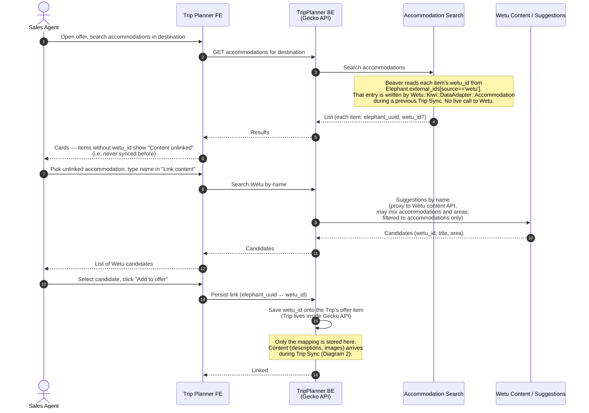
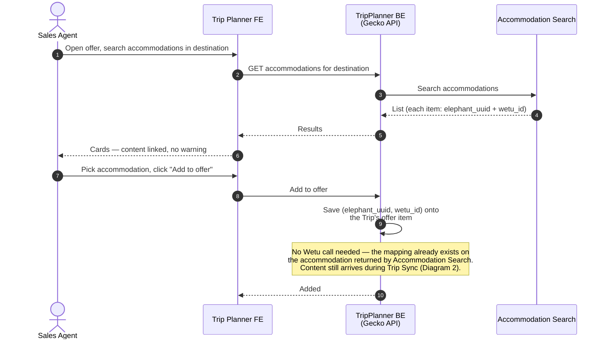
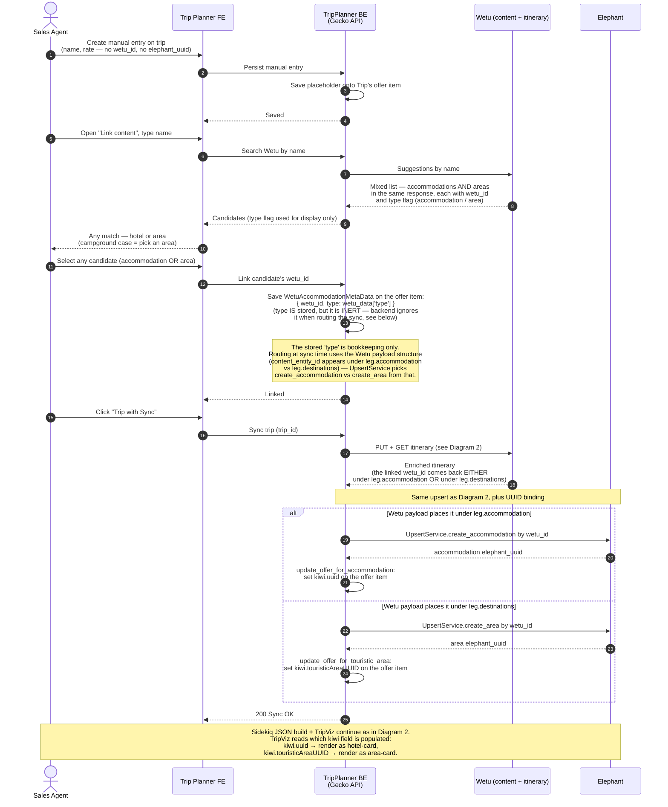
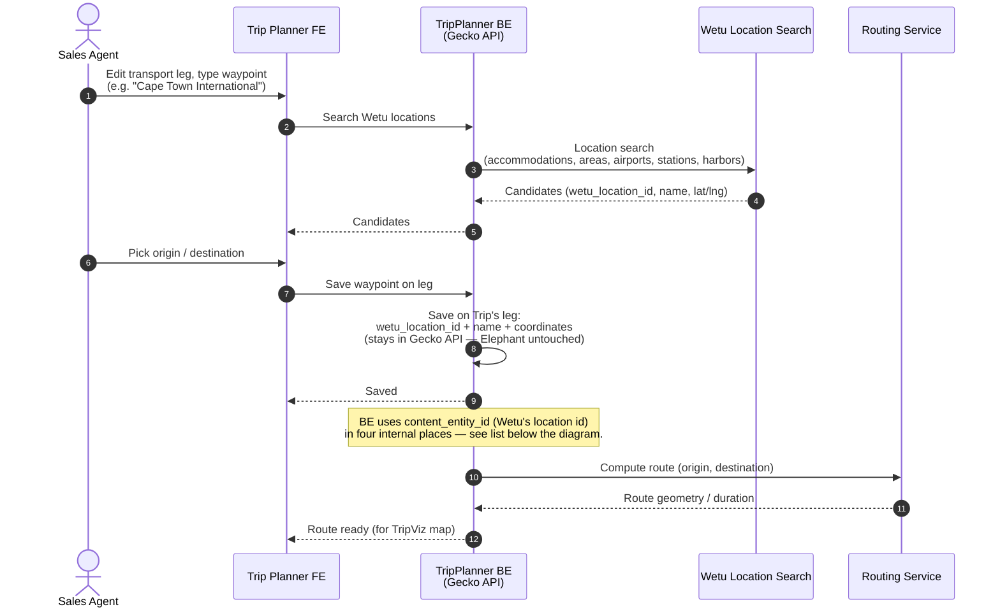

# TripPlanner ↔ Wetu — current-state sequence diagrams

Actors / systems used throughout:

- **Sales Agent** — operator in TripPlanner.
- **Trip Planner FE** — the agent UI.
- **TripPlanner BE** (a.k.a. Gecko API) — backend that orchestrates everything below.
- **Accommodation Search** — external service codenamed "Beaver" (`REACT_APP_ACCOMMODATION_SEARCH_URL/pricing/v3/...`). Returns each accommodation with an optional `wetu_id` field that Beaver reads from Elephant's `external_ids` array (entry where `source === 'wetu'`). It does **not** call Wetu directly.
- **Wetu** — external supplier. Two surfaces are used: the **Content / Suggestions API** (search by name) and the **Itinerary API** (private, used to pull enriched content per itinerary).
- **Elephant** — internal accommodation / touristic-area store. Source of truth for content shown to customers via TripViz.
- **Routing Service** — our routing / geometry service that computes routes and geometry for transport legs.
- **Sidekiq Worker** — TripPlanner BE's background-job processor (`Trip::UploadWorker` builds the TripViz JSON; `WetuSyncWorker` is used for async re-syncs).
- **Salesforce CRM** — receives an opportunity-owner update during Trip Sync (`SyncOpportunityOwner`).
- **S3** — storage for the generated TripViz JSON.
- **Lambus** — receives the same JSON payload as S3 from `Trip::UploadWorker`.
- **TripViz** — customer-facing trip visualization, reads its JSON from S3. Never talks to Wetu.

---

## Diagram 1 — Link content: mapping an existing accommodation to a Wetu record

Context. An accommodation returned by Accommodation Search without a `wetu_id` shows a "Content unlinked" warning. The agent uses the "Link content" form to search Wetu by name and pick a match. Only the **mapping** (`wetu_id` saved onto the offer item inside the Trip) is persisted at this step — no descriptions or images are fetched yet. The Trip object itself lives inside Gecko API, so this is a local write; Elephant is not touched here.



Post-deprecation note. When we stop taking content from Wetu, the "Link content" form goes away. Accommodation Search keeps working unchanged — Beaver reads `external_ids` from Elephant, so as long as each accommodation has *some* non-Wetu external_id (catalog id, Expedia id, …), the same gate keeps working with a different source. We just stop populating the `source === 'wetu'` entry going forward.

Offline side flow (not drawn). If Accommodation Search returns nothing for the name the agent needs, the agent reaches out to the Content Integration team. That team batches requests, emails Wetu (Excel list mentioned on the Miro sketch), waits 1–4 days for Wetu to populate content, then runs the Trip Sync themselves. Entirely out-of-band — no TripPlanner UI involved — so it's not drawn as a sequence diagram, but it's the implicit "otherwise" branch of this flow.

---

## Diagram 1b — Happy path: picking an accommodation that already has `wetu_id`

Context. This is the short alternative to Diagram 1. If Accommodation Search returns the accommodation with a `wetu_id` already attached (it was linked on a previous trip and the content is already in Elephant), the agent just picks it — no "Link content" form, no Wetu round-trip. The `wetu_id` is saved onto the Trip's offer item and the offer is ready for Trip Sync (Diagram 2).



Precondition for Trip Sync. Trip Sync can only run once **every** accommodation on the Trip has a `wetu_id` attached to its offer item — i.e. every accommodation has gone through either Diagram 1a or Diagram 1b (or Diagram 3 for manual input).

---

## Diagram 2 — Trip Sync: enriching the itinerary via Wetu's Itinerary API

Context. The heavy interaction. On "Trip with Sync", TripPlanner BE sends the itinerary skeleton (`wetu_id`s + leg dates) to Wetu's **itinerary** API, pulls the enriched itinerary back, and upserts accommodations and touristic areas into Elephant. A Sidekiq job then builds the TripViz JSON purely from Elephant (Wetu is not touched in that step).

Two important callouts from Gregor:
- The endpoint id pulling the enriched itinerary is Wetu's **private** API (the one that drives their own UI). 
- Before end-2024, area hierarchy was derived purely from polygons imported from Wetu. Polygons became unreliable / missing, so we additionally persist the explicit accommodation → area mapping that Wetu exposes in the enriched itinerary.

Code references for the orchestration (added after a code review by Aliaksei): `Offers::TripVizSync` (entry point), `Wetu::Kiwi::ItinerarySync` (Wetu interaction — calls `sync_destinations!` **before** `sync_accommodations!`), `SyncOpportunityOwner` (Salesforce CRM update, runs synchronously after Wetu sync), `Offers::VisualizationBuilder#persist_trip_to_s3_and_lambus` (enqueues `Trip::UploadWorker`, which uploads to **both** S3 and Lambus), `Wetu::UpdateService.sync` (sync vs async dispatcher), `WetuSyncWorker` (async re-sync path used when `complete_trip_viz_content?` && `wetu_viz_present?`).

```mermaid
sequenceDiagram
    autonumber
    actor Agent as Sales Agent
    participant TP as Trip Planner FE
    participant BE as TripPlanner BE<br/>(Gecko API)
    participant Wetu as Wetu Itinerary API
    participant Eleph as Elephant
    participant SF as Salesforce CRM
    participant SK as Sidekiq (BE)
    participant S3 as S3
    participant Lambus as Lambus
    participant TripViz as TripViz (customer)

    Agent->>TP: Click "Trip with Sync"
    TP->>BE: Sync trip (trip_id)
    Note over BE: Offers::TripVizSync entry point.<br/>Build itinerary skeleton by reading the Trip's<br/>offer items: accommodation wetu_id per leg,<br/>leg dates, theme, branding (legacy, unused).<br/><br/>If complete_trip_viz_content? && wetu_viz_present?<br/>Wetu::UpdateService.sync delegates to WetuSyncWorker<br/>(async path — see note below). Otherwise sync runs<br/>inline as drawn here.

    BE->>Wetu: PUT itinerary<br/>(accommodation wetu_ids + dates)
    Wetu-->>BE: Itinerary upserted
    BE->>Wetu: GET LoadItinerary/{identifier}<br/>(single REST GET — Wetu::ItineraryExtractionDataService)
    Wetu-->>BE: Single JSON response with content[]:<br/>• accommodations — filtered from content[] by matching<br/>  itinerary.legs[].content_entity_id; descriptions (all langs), images<br/>• touristic areas — built from itinerary.legs[].content_entity.destinations<br/>  matched back into content[] (Cape Town → Western Cape → South Africa → Africa,<br/>  polygons when available)<br/>• accommodation → area mapping<br/>  (pairs of wetu_ids on each accommodation)

    Note over BE,Eleph: Wetu::Kiwi::ItinerarySync runs<br/>sync_destinations! BEFORE sync_accommodations!

    loop For each touristic area in content[] (sync_destinations!)
        BE->>Eleph: Find area by wetu_id<br/>(Wetu::Kiwi::DataAdapter::Destination —<br/>area record stores wetu_id directly as an attribute)
        alt Exists
            BE->>Eleph: Update descriptions, images, polygon<br/>(by elephant_uuid, polygon if present)
        else New
            BE->>Eleph: Create area<br/>(PK = new elephant_uuid, attribute = wetu_id)
        end
    end

    loop For each accommodation in content[] (sync_accommodations!)
        BE->>Eleph: Find accommodation by external_ids[source=='wetu']<br/>(Wetu::Kiwi::DataAdapter::Accommodation)
        alt Exists in Elephant
            BE->>Eleph: Update descriptions, images<br/>(by elephant_uuid)
        else New
            BE->>Eleph: Create accommodation<br/>(PK = new elephant_uuid,<br/>external_ids += {source: 'wetu', external_id: wetu_id})
        end
        Note over BE: map_wetu_ids_to_kiwi_uuids resolves the area<br/>wetu_ids from the payload to elephant_uuids<br/>(using each area's wetu_id attribute set above)
        BE->>Eleph: Set touristic_area_uuids on accommodation<br/>(array of elephant_area_uuids — NO wetu_ids leak here)
    end

    Note over BE,SF: Still on the synchronous response path
    BE->>SF: SyncOpportunityOwner<br/>(opportunity-owner update)
    SF-->>BE: OK

    BE->>SK: Offers::VisualizationBuilder#persist_trip_to_s3_and_lambus<br/>enqueues Trip::UploadWorker (trip_id)<br/>— async, does not block the response
    BE-->>TP: 200 Sync OK
    TP-->>Agent: "Trip synced" toast

    Note over SK: Trip::UploadWorker:<br/>resolve Trip → offer items → elephant_uuids
    SK->>Eleph: Fetch accommodations, areas, country,<br/>descriptions, images (all queries by elephant_uuid)
    Eleph-->>SK: Aggregated data (no Wetu calls in this step)
    SK->>S3: PUT tripviz.json
    SK->>Lambus: PUT same payload<br/>(Lambus receives the same JSON as S3)

    TripViz->>S3: GET tripviz.json (on customer open)
    S3-->>TripViz: JSON
    TripViz-->>Agent: Customer-facing trip view
```

Async re-sync path (not drawn). When the offer was already fully synced before — `complete_trip_viz_content?` && `wetu_viz_present?` — `Wetu::UpdateService.sync` does **not** run the Wetu interaction inline. It enqueues `WetuSyncWorker` and the FE gets `200 Sync OK` immediately; the worker then performs the same Wetu round-trip + Elephant upserts + Salesforce update + S3/Lambus upload sequence shown above, just out-of-band. The diagram covers the first-sync (synchronous) path because that's the primary one.

### ID storage in Elephant after Trip Sync (verified via code review)

| Where the ID lives | What it is | Who reads it |
|---|---|---|
| `accommodation.external_ids[source=='wetu'].external_id` | `wetu_id` (= `content_entity_id`) | Beaver / Accommodation Search to attach `wetu_id` to results; sync to find existing accommodation |
| `area.wetu_id` (direct attribute) | `wetu_id` | sync to find existing area; the only **real Wetu-ID leak** in Elephant — needs retiring during deprecation |
| `accommodation.touristic_area_uuids` | array of **elephant_area_uuids** (resolved via `map_wetu_ids_to_kiwi_uuids` before persisting) | trip viz, area-hierarchy queries |

So accommodations carry the Wetu identity behind a neutral `external_ids` array (easy to swap for catalog ids later), while areas still hold a literal `wetu_id` column — that's the leak to plan for at deprecation.

| Other ID touchpoints in the flow | ID in use | Source |
|------|-----------|--------|
| Sync trigger TP FE → BE | `trip_id` | code |
| Build itinerary skeleton | `wetu_id` per accommodation, read off the Trip's offer items | code |
| PUT / GET itinerary at Wetu | `wetu_id` on the wire (forced by Wetu's API) | code |
| `Trip::UploadWorker` argument | `trip_id`; worker resolves it to `elephant_uuid`s | code |
| Sidekiq fetches from Elephant | all queries by `elephant_uuid` | code |
| S3 / Lambus payload | same JSON, both written by `Trip::UploadWorker` | code |

Post-deprecation note. This is the interaction we want to remove. Content should come from catalog (Expedia / own-managed) instead of Wetu. Gregor: *"this would all just go away, without replacement"* — the upsert-into-Elephant half and the Sidekiq / S3 / TripViz half stay; only the Wetu calls and the Wetu-sourced content drop out.

Addresses the open question pinned on the Miro sketch ("why is area syncing done separately from the itinerary API call?") — it isn't a separate call. Areas arrive inside the same enriched itinerary payload as accommodations; we just branch on type and upsert into different Elephant tables. Worth re-checking in code that there's truly no second round-trip.

---

## Diagram 3 — Manual input with Link Content (accommodation or area, same flow)

Context. Used where there is no DMC API connection (Accommodation Search returns nothing). The agent creates a manual entry on the Trip **without** an Elephant UUID. Link Content returns a **mixed list** from Wetu — both accommodations and areas in the same response — and the agent can pick any one of them. **Both kinds of item are linked the same way**: the picked `wetu_id` is saved onto a single slot on the manual entry, with no type flag stored alongside it. The accommodation-vs-area distinction only surfaces later, at render time, when TripViz fetches the resolved Elephant entity and sees whether it's an accommodation record or an area record. The campground case is just a concrete instance of picking an area (e.g. "Cape Town") instead of a hotel — same operation, same storage, different rendering downstream.

Because there is no Elephant UUID yet, the first Trip Sync both enriches content **and** establishes the `elephant_uuid` on the manual entry so the invariant "TripViz only reads Elephant" holds.



Post-deprecation note. Replace the Wetu search with a search against our own catalog that returns the same mixed list (accommodations + areas). The offer-item storage contract is unchanged — still a single neutral slot for the source-of-content id, with the inert `type` left in for backwards compatibility (or removed). The UUID-binding-on-first-sync step goes away because picking a catalog item already returns an `elephant_uuid` directly, so `kiwi.uuid` / `kiwi.touristicAreaUUID` can be set immediately at link time.

---

## Diagram 4 — Transport leg location search (self-contained)

Context. For transport legs we need named waypoints with coordinates (airport, train station, harbor, ferry port, sometimes even an accommodation acting as a pickup point). These are pulled from Wetu's location search and saved onto the Trip's leg inside Gecko API — **nothing is written to Elephant**. The Routing Service then computes the geometry between the two waypoints so TripViz can draw the line with a proper route.



Wetu-id touchpoints inside Gecko (verified via code review). Four places will need attention at deprecation, not just the round-trip / same-start-end check:

1. **`RoutingClient` same-location skip** (`routing_client.rb:13`) — `return if start_location.content_entity_id == end_location.content_entity_id` skips computing a route if both ends are the same Wetu entity. Replace with a geo-distance or lat/lng equality check.
2. **Round-trip / same-start-end transport identity** — the original case Gregor flagged.
3. **Adjacent transport matching when replacing an accommodation** (`trip/operations/transport_helper.rb:9,17`) — `transport.end_location.content_entity_id == accommodation.wetu_meta_data.content_entity_id` is used to find the leg that arrives at / departs from the accommodation being swapped, so the leg's endpoint can be updated. Structural — needs a stable location identity from whatever replaces Wetu.
4. **Transport recommendation routing** (`transport/route_endpoint_adapter.rb:46,73-76`) — `Pg::WetuLocation.safe_find_by(content_entity_id:)` resolves a transport hub's `content_entity_id` to Kiwi accommodation/area UUIDs for the recommendation service. The whole `Pg::WetuLocation` table (populated by `Wetu::ImportLocationsJob`, triggered inside `Trip::Uploader`) is a Wetu-identity → Kiwi-UUID bridge for transport. If Wetu goes away, this bridge needs a replacement — e.g. keyed on Google Places IDs or lat/lng.

Post-deprecation note. Originally framed as *"a story on a sprint, not an initiative"*, but the third and fourth touchpoints above (transport replacement matching, the `Pg::WetuLocation` bridge) are more structural than just swapping a search backend. Worth scoping the work properly before committing to that framing. The location-search swap (Google Places / Nominatim) is still the easy part.

---

## Answers from code review (Aliaksei, 2026-04-27)

The seven questions that started as "to refine together" are now answered against the source. Findings folded into the diagrams above; this section keeps the answers verbatim for traceability.

**Q1 — Where does Accommodation Search get the `wetu_id`?**
Accommodation Search is an external service (codenamed "Beaver"), not Gecko. The FE calls `REACT_APP_ACCOMMODATION_SEARCH_URL/pricing/v3/...`. The response type `IAccommodationStreamData` exposes `wetu_id?: string | null`, populated from Elephant's `external_ids` array — specifically the entry where `source === 'wetu'` (`getWetuId` in `AccommodationMap/utils.ts:142`). That entry was written to Elephant by `Wetu::Kiwi::DataAdapter::Accommodation` during a previous Trip Sync (`external_id: wetu_accommodation.content_entity_id.to_s.presence`). So Beaver reads `wetu_id` from Elephant, not from Wetu directly. If an accommodation has never been synced, Elephant has no entry and Beaver returns `wetu_id: null` → "Content unlinked". *Implication for deprecation:* once content comes from catalog, as long as Elephant has a non-Wetu `external_id`, Accommodation Search returns it the same way. Same gate, different source.

**Q2 — Are areas and accommodations from the same itinerary API call?**
Yes, single call. `Wetu::ItineraryExtractionDataService` makes one REST GET to `https://wetu.com/Itinerary/JSON/LoadItinerary/{identifier}`. Both accommodations and areas come out of the same `response['content']` array. Accommodations are filtered by matching `content_entity_id` against `itinerary.legs`; areas are built from `itinerary.legs[].content_entity.destinations` matched back into `content[]`. Two loops in code, one network call. The Miro question *"why area syncing done separately?"* is a naming artefact.

**Q3 — Accommodation→area mapping: where stored, are Wetu IDs leaked into Elephant?**
Stored on the accommodation as `touristic_area_uuids` — an array of Elephant (Kiwi) UUIDs. The mapping is resolved from Wetu IDs to Kiwi UUIDs before persisting (`Wetu::Kiwi::DataAdapter::Accommodation#map_wetu_ids_to_kiwi_uuids`). **No Wetu IDs leak via the mapping itself.** *However:* the area record stores `wetu_id` directly as an attribute (`data_adapter/destination.rb:15`), which IS a real Wetu ID inside Elephant — to be retired or replaced with a catalog ID at deprecation.

**Q4 — Manual entry storage: type-agnostic slot? does TripViz read type from Elephant?**
(a) The wetu slot stores a `type` field (from `WetuAccommodationMetaData`: `type: wetu_data['type']`), so it *is* persisted — but at sync time the backend ignores it. Whether `UpsertService` calls `create_accommodation` vs `create_area` is determined by where in the Wetu enriched itinerary the `content_entity_id` shows up (under leg accommodation vs leg destination). The stored `type` is inert for routing.
(b) TripViz distinguishes via which Kiwi subfield is populated after sync — `kiwi.uuid` means accommodation, `kiwi.touristicAreaUUID` means area (set by `update_offer_for_accommodation` vs `update_offer_for_touristic_area` in `UpsertService`). Those fields ultimately reflect the Elephant entity type, so the diagram's claim ("TripViz infers from Elephant") holds.

**Q5 — What else in Gecko is keyed on `content_entity_id` / `wetu_location_id`?** See the four touchpoints listed under Diagram 4.

**Q6 — Content Integration team offline flow.**
No code. Genuinely out-of-band — emails, Excel files, manual sync runs by CIT. Confirmed it's not drawn anywhere in the codebase. The prose note under Diagram 1 stands.

**Q7 — Are theme / branding buttons actually dead?**
Alive in the UI, sent to Wetu, ignored by TripViz. `Wetu::BasicInformationSerializer` sends `OperatorThemeId` and `OperatorIdentityId` in every `save_itinerary` SOAP call. They affect only Wetu's own rendering on their side. TripViz never reads them. When the Wetu sync is removed, the FE fields (`TripDetailsForm.tsx:402-416`) and the serializer lines become dead code — delete both.
